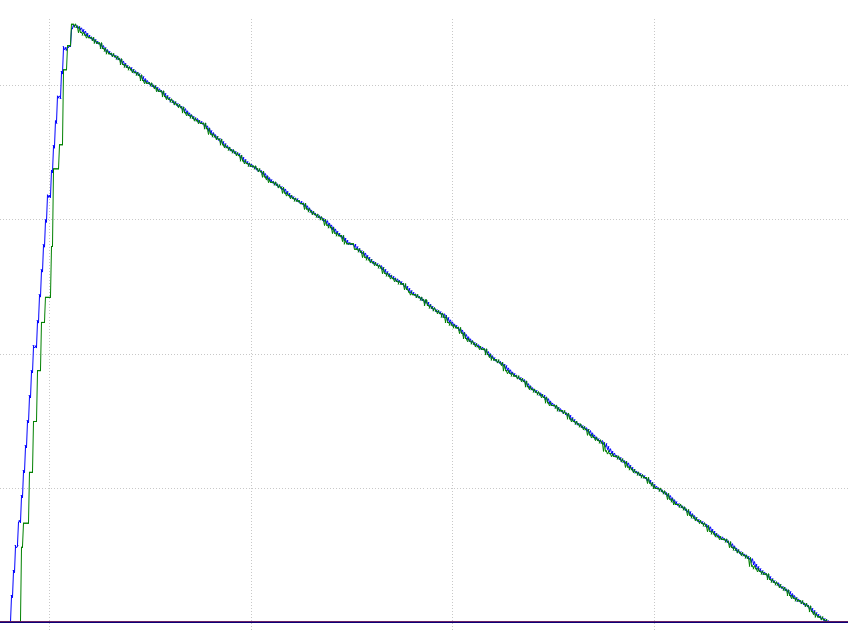
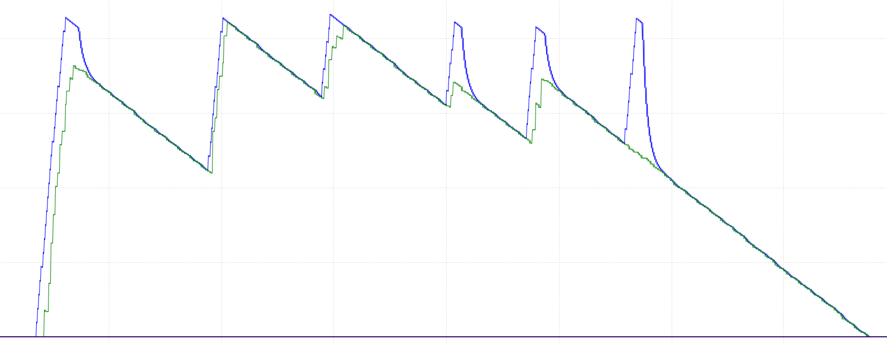

# 热量检测

热量检测的代码在[`crt_booster.cpp`](../../../User/Chariot/crt_booster.cpp)文件中的`Class_FSM_Heat_Detect::Reload_TIM_Status_PeriodElapsedCallback`函数中。

## 为什么要手动计算热量

裁判系统热量数据发送的频率太低，导致再关键位置无法做出有效判断。

例如在裁判系统热量剩余40可用时，程序会认为还能发弹，但由于数据不够实时，实际上的热量可能已经只剩下不足10点，继续发弹就会导致超出限制。

因此，自行实现热量的计算是必要的。

## 热量测算算法

先前的热量检测算法是依靠摩擦轮扭矩变化超过阈值加上延迟实现的。
这样得到的数据偶尔会不准，可能会漏算，导致热量超限，于是改成了通过拨弹盘角度变化计算：
每当拨弹盘拨动超过40°(拨弹盘一圈是9颗弹丸)，就视为发弹一次。

但这样也有问题，就是可能拨弹盘某个位置实际没有弹丸，但程序上仍将其视为发射了一发弹丸，导致热量计算偏多，无法充分利用热量。

首先是定义一些需要用到的常量和变量，并初始化。

```cpp
// 每发弹丸对应拨弹盘的运动位移角度
constexpr float ANGLE_PER_BULLET = 40.0f;

// 当拨弹盘走过位移角度的多少时，便判定为发弹
constexpr float SHOOT_JUDGE_RATIO = 0.9f;

// 拨弹盘初始角度偏移量
static float ANGLE_OFFSET = 0.0f;

// 初始化判断标志位
static bool is_initialized = false;

if (!is_initialized) {
    // 初始化拨弹盘角度偏移量
    ANGLE_OFFSET   = Booster->Motor_Driver.Get_Now_Angle();
    is_initialized = true;
}
```

然后开始计算热量的变化并判断发弹。

```cpp
// 当前拨弹盘总位移角度
float total_displacement = Booster->Motor_Driver.Get_Now_Angle() - ANGLE_OFFSET;

// 当下发弹量对应的拨弹盘位移
float expected_displacement = Booster->actual_bullet_num * ANGLE_PER_BULLET;

// 发弹判断
float delta = total_displacement - expected_displacement;
if (delta > ANGLE_PER_BULLET * SHOOT_JUDGE_RATIO) {
    Booster->actual_bullet_num++;
    Heat += 10.0f;
}
```

## 数据修正算法（影子跟随算法）

数据的修正是必要的，因为在计算发弹的过程中，多算或者漏算总是不可避免的。

在测试环境中，能等待自行测算的热量冷却到零从而被动地消除误差。
但在实际赛场上，往往没有时间去等待热量恢复到0，大多情况是热量尚未完全冷却就要继续射击了。

此时，多算或者漏算造成的误差，没有机会得到消除，反而会在多轮射击后，误差积累越来越大，最终出现热量超限或者热量还剩余大半但打不出弹的情况。

因此，一个修正算法是必要的。

最初的想法是，继续依靠摩擦轮扭矩做辅助判断，但实际观测摩擦轮扭矩数据后发现，数据噪声太大，规律不明显，实现起来比较困难。
于是采用了依靠裁判系统数据，利用影子跟随算法修正的方案。

仍然是定义一些需要用到的常量。

```cpp
// 是否启用依靠裁判系统数据的同步机制，以消除多算或少算发弹的误差
constexpr bool IS_SHADOW_SYNCHRONIZATION_ENABLE = true;

// 计算得到的热量比裁判系统低时，本地热量追赶的速度系数
constexpr float HEAT_CHASE_FACTOR = 0.05f;

// 计算得到的热量比裁判系统高时，本地热量等待的速度系数
constexpr float HEAT_WAIT_FACTOR = 0.005f;
```

然后开始对数据进行修正。

```cpp
uint16_t referee_heat = Booster->Referee->Get_Booster_17mm_1_Heat();

if (IS_SHADOW_SYNCHRONIZATION_ENABLE) {
    // 与裁判系统值比对，修正误差
    float error = referee_heat - Heat;
    if (error > 0) {
        // 补偿少算
        Heat += HEAT_CHASE_FACTOR * error;
    } else if (Booster->Get_Booster_Control_Type() == Booster_Control_Type_DISABLE ||
               Booster->Get_Booster_Control_Type() == Booster_Control_Type_CEASEFIRE) {
        // 当停止发射时才补偿多算
        Heat += HEAT_WAIT_FACTOR * error;
    }
}
```

此处只在停火时才开始补偿多算的部分，是为了防止在开火时可能造成的负面影响，导致超出热量限制。

在停火时，多算的数据会被迅速修正，避免长久积累导致大量热量无法被利用。

下面的两张图分别是拨弹盘没有空弹的情况下，和弹量不足，拨弹盘开始大量出现空弹的情况下的热量数据。

其中蓝色的曲线是本地算法计算得到的热量，绿色的曲线是从裁判系统读取到的热量。





可以发现，在理想条件下，热量数据与裁判系统数据吻合准确。在出现空弹的情况下，停火后也能迅速在短时间内将数据修正，避免负面影响。

### 注意事项

#### 如何停用此算法

将前面定义的常量`IS_SHADOW_SYNCHRONIZATION_ENABLE`赋值为`false`即可。

#### 确保能从裁判系统读取到数据

由于云台的裁判系统热量数据是底盘通过`CAN`总线发送过来的，当数据无法正常接收时，数据修正算法将会失效，并造成严重的负面影响。这一点在实测中不时会有`CAN`数据包无法接收的情况，问题有所体现。

一个解决方案是，为底盘向云台发送热量数据的`CAN`包加上一个序列字段，通过序列字段判断裁判系统数据是否有效，进而决定是否关停数据修正算法。这个序列字段也可以在云台的`CAN`接收函数中实现。
